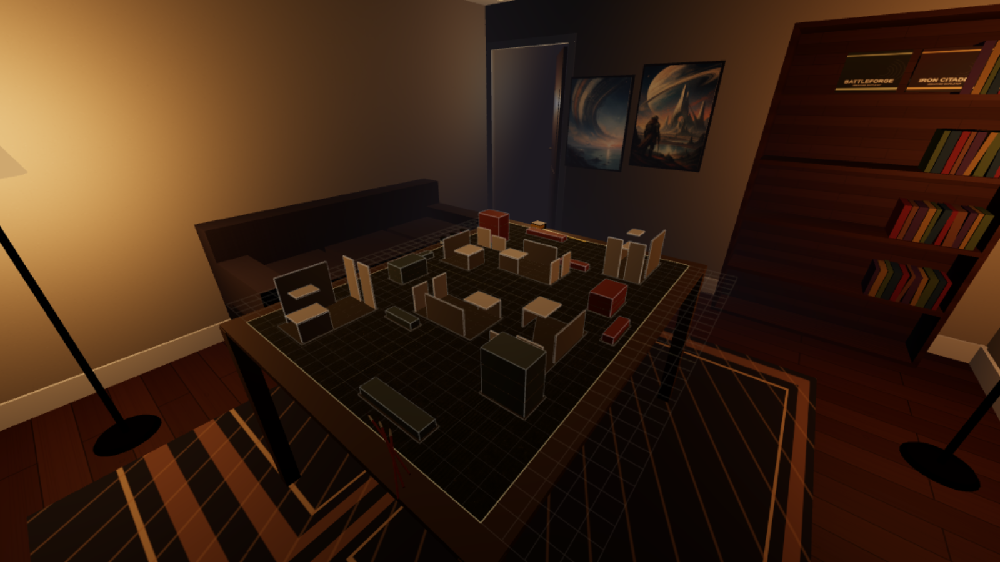

# Warzone Tabletop

Explore a miniature battlefield from the miniature's point of view. Run through painted ruins, switch between three differently sized bodies, launch a jump pack, and roll a physical D6 on a hobby table inside a full-size home den.

This is a desktop-browser exploration prototype inspired by Warhammer 40,000. It has no combat, opponents, multiplayer, or tabletop rules engine.



## Run locally

Use Node.js 22.12 or newer and npm, with a desktop browser that supports WebGL 2, a keyboard, and a mouse.

From the project directory:

```sh
npm ci
npm run dev
```

Open the local URL printed by Vite, then click **Enter the battlefield** to capture the mouse. Press **Esc** to release it. Stop the server with **Ctrl+C** in its terminal.

No account, API key, backend, or scanning hardware is needed. Mouse sensitivity is saved in the browser for the current site address; it does not travel with the project folder.

For a first visit, follow the [five-minute exploration](docs/tutorials/first-visit.md).

## Controls

| Input | Action |
| --- | --- |
| Mouse | Look while the mouse is captured |
| W / A / S / D | Run / strafe |
| Either Shift key | Sprint |
| Space, tap | Jump |
| Space, hold as Primaris | Fire the jump pack; start the hold while standing on a surface |
| 1 / 2 / 3 | Guardsman / Sister of Battle / Primaris Space Marine |
| R | Roll the D6 |
| Esc | Release the mouse and open the pause menu |
| Backquote (`~` key on US keyboards) | Toggle controller telemetry |

**Options**, available from the main and pause menus, adjusts mouse sensitivity. **Resume** captures the mouse again. Falling off the table returns you to the starting position.

## Build and preview

```sh
npm run build
npm run preview
```

The build type-checks the application and writes the static site to `dist/`. Preview serves that build locally. Open the URL it prints; use **Ctrl+C** to stop it.

The application uses TypeScript, Three.js, Vite, and `cannon-es` for dice physics. Dependency versions and runnable commands live in [package.json](package.json) and [package-lock.json](package-lock.json).

## Develop

- [Make and verify a change](docs/how-to/change-and-check.md): source entry points, browser checks, and targeted manual verification.
- [Understand the design](docs/explanation/design.md): scale, movement, camera, terrain, and physics choices.
- [Current outstanding work](STATUS.md): a short list of unresolved tasks.
- [Agent guidance](AGENTS.md): shared repository instructions.

Gameplay tuning lives in [game-constants.json](game-constants.json), imported by [src/constants.ts](src/constants.ts). Input bindings live in [InputManager](src/player/input.ts); the JSON is not a general key-binding interface.

## Prototype limitations

Terrain is procedural and approximate, including the large polygon footprints. Player collision assumes horizontal surfaces and axis-aligned wall volumes. The dice feature still needs a full manual acceptance pass; a successful build or controller check does not establish dice fairness or validate every collision case.

Terrain capture and scanning tools are a separate project and are not required to build or run this application.

## Assets and licensing

See [asset provenance](public/assets/textures/README.md) for the shipped textures. A project license has not yet been selected. Warzone Tabletop is an independent fan project and is not affiliated with Games Workshop.
